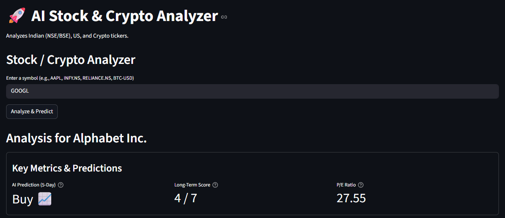

# 🚀 AI Stock & Crypto Analyzer

This is a full-stack, AI-powered financial dashboard built with Python and Streamlit. It provides a comprehensive analysis for any stock or cryptocurrency (from NSE, BSE, or US markets) with a clean, professional, and mobile-friendly UI.

This project combines two different AI models to give both a short-term and long-term prediction.

---

## 📸 App Screenshots

*(Note: Just make sure your screenshot files are named `desktop-view.png` and `mobile-view.png` and are in the same folder as this file!)*

| Desktop View | Mobile View |
| :---: | :---: |
|  |  |

---

## ✨ Features

* **Universal Ticker Support:** Analyzes any stock from `yfinance` (e.g., `RELIANCE.NS`, `AAPL`, `BTC-USD`).
* **Short-Term AI Prediction:**
    * Trains a fast, simple `RandomForestClassifier` on 1 year of historical data.
    * Uses 4 key technical indicators (MAs, RSI, Volume) to generate a "Buy," "Sell," or "Hold" signal for the next 5 days.
* **Long-Term AI Recommendation:**
    * A rule-based AI that analyzes 7 critical fundamental metrics (P/E, PEG, Debt, etc.).
    * Provides a clear "Long-Term Buy 🟢", "Hold 🟡", or "Sell 🔴" recommendation for a 3-6+ month outlook.
* **Professional Dashboard:**
    * Clean, 4-row layout using `st.container(border=True)` for a professional "card" look.
    * Fully responsive—stacks vertically for a perfect mobile experience.
* **Reliable News Feed:**
    * Integrates the **Finnhub API** for a stable, real-time news feed (for supported US stocks).
    * Fails silently with no errors for unsupported international stocks.

---

## 🛠️ Technology Stack

* **Core:** Python
* **Web Framework:** Streamlit
* **Data Source (Price/Fundamentals):** `yfinance`
* **Data Source (News):** `finnhub-python`
* **Machine Learning:** `scikit-learn` (RandomForest)
* **Data Manipulation:** `pandas`, `numpy`
* **Visualization:** `plotly`

---

## 🚀 How to Run

Follow these steps to run the project on your local machine.

### 1. Get Your Free API Key
This app requires a free API key from Finnhub to fetch news.
1.  Go to **[finnhub.io](https://finnhub.io/)** and sign up for a free account.
2.  Copy your API key from your dashboard.
3.  Paste the key into `app.py` in the `FINNHUB_API_KEY` variable.

### 2. Set Up Your Environment
```bash
# Clone this repository (or download the files)
git clone [https://github.com/nishadraval/aistock.git](https://github.com/nishadraval/aistock.git)
cd aistock

# Create and activate a virtual environment
python -m venv venv
source venv/bin/activate  # On Windows: venv\Scripts\activate
